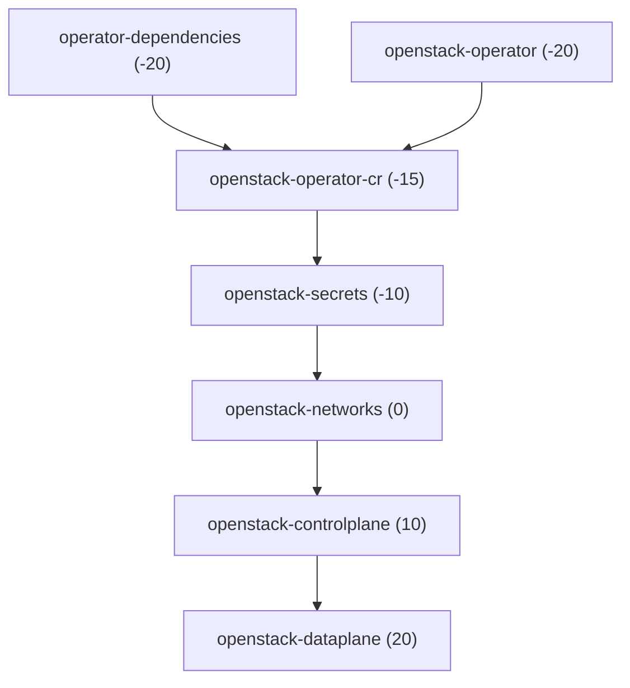

# rhoso-apps Helm chart

This chart renders Argo CD `Application` resources to deploy Red Hat OpenStack Services on OpenShift (RHOSO) and related manifests from Git. Chart-wide defaults apply to every rendered application; each entry under `applications` is optional and can be toggled or overridden independently.

## Chart-wide values

| Key | Type | Description |
|-----|------|-------------|
| `applicationNamespace` | string | Namespace for the Argo CD `Application` CRs (`metadata.namespace`). Default: `openshift-gitops`. |
| `destinationServer` | string | `spec.destination.server` for every application. Default: `https://kubernetes.default.svc`. |

This chart does not set `spec.destination.namespace`; only `destination.server` is set (from `destinationServer`).

## Per-application keys (`applications.<name>`)

Each `<name>` is a unique key (DNS-1123). Set `enabled: true` to render that `Application`; set `enabled: false` to skip it.

| Key | Type | Description |
|-----|------|-------------|
| `enabled` | bool | If `true`, render an `Application` CR; if `false`, skip. |
| `repoURL` | string | `spec.source.repoURL` (Git URL). |
| `path` | string | Directory in the repo; empty uses default `"."`. |
| `targetRevision` | string | Branch, tag, or commit; empty uses default `"HEAD"`. |
| `syncWave` | string | `argocd.argoproj.io/sync-wave` annotation. |
| `syncOptions` | list | Optional strings merged into `spec.syncPolicy.syncOptions` (for example `Prune=true`). |
| `kustomize` | map | Optional; passed to `spec.source.kustomize` (`namePrefix`, `patches`, `components`, etc.). See [Argo CD Kustomize](https://argo-cd.readthedocs.io/en/stable/user-guide/kustomize/). |
| `finalizers` | list | `metadata.finalizers` (Argo CD resources finalizer). Valid: `resources-finalizer.argocd.argoproj.io/background` or `.../foreground`. Omit to use chart default (background). |
| `project` | string | Argo CD `AppProject`; default `default` if unset. |
| `syncPolicy` | map | Merged with `syncOptions` into `spec.syncPolicy`. |

### Adding a new application

Copy a block under `applications`, choose a unique key, set `enabled: true`, and set `repoURL`, `path`, and `targetRevision` as needed.

### Default applications (from `values.yaml`)

These entries ship enabled by default; each has a `syncWave` that defines Argo CD apply order (lower waves first).

| Application | Purpose (summary) | Default `syncWave` |
|-------------|---------------------|--------------------|
| `operator-dependencies` | MetalLB, nmstate, cert-manager | `-20` |
| `openstack-operator` | OpenStack operator | `-20` |
| `openstack-operator-cr` | Main OpenStack custom resource | `-15` |
| `openstack-secrets` | Vault secrets operator | `-10` |
| `openstack-networks` | Control plane and dataplane networks | `0` |
| `openstack-controlplane` | `OpenStackControlPlane` | `10` |
| `openstack-dataplane` | Data plane node set and deployment | `20` |

## Default application ordering (sync waves)

Replace the placeholder below with a diagram of the default sync-wave ordering for the applications listed in `values.yaml`.



## Layered values and partial overrides

Helm merges values files left to right: later files override earlier ones. Keep a **base** `values.yaml` (or your fork of the chart defaults) and add **environment** files that only change what differs (for example one Git revision, one path, or a single application).

### Install with base + environment file

```bash
helm install deploy-rhoso . \
  -f values.yaml \
  -f values-prod.yaml
```

Use any release name and paths; `values-prod.yaml` can be minimal.

### Example: override Git revision for all apps that share defaults

`values-revision.yaml`:

```yaml
applications:
  operator-dependencies:
    targetRevision: main
  openstack-operator:
    targetRevision: main
  openstack-operator-cr:
    targetRevision: main
  openstack-secrets:
    targetRevision: main
  openstack-networks:
    targetRevision: main
  openstack-controlplane:
    targetRevision: main
  openstack-dataplane:
    targetRevision: main
```

```bash
helm template deploy-rhoso . -f values.yaml -f values-revision.yaml
```

### Example: change only one application

Disable or repoint a single app without repeating the rest of `values.yaml`:

`values-disable-dataplane.yaml`:

```yaml
applications:
  openstack-dataplane:
    enabled: false
```

`values-custom-controlplane-path.yaml`:

```yaml
applications:
  openstack-controlplane:
    path: environments/prod/controlplane
    targetRevision: v1.2.3
```

```bash
helm install deploy-rhoso . -f values.yaml -f values-custom-controlplane-path.yaml
```

### Example: Kustomize overrides for one application

`values-dev-prefix.yaml`:

```yaml
applications:
  openstack-networks:
    kustomize:
      namePrefix: dev-
```

### Example: chart-wide + per-app in one overlay

`values-staging.yaml`:

```yaml
destinationServer: https://kubernetes.default.svc
applications:
  openstack-operator:
    targetRevision: staging
  openstack-controlplane:
    syncWave: "15"
```

Later keys win for the same path; unspecified keys under `applications.<name>` keep values from `values.yaml`.

## See also

- [Argo CD Application specification](https://argo-cd.readthedocs.io/en/stable/operator-manual/application-specification/)
- Chart templates: `templates/application.yaml`, `templates/_helpers.tpl`
